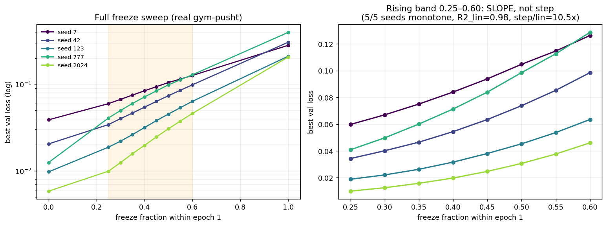

# E32 — Sub-epoch freeze sweep on REAL data (Ф46 confirmation)

**Date:** 2026-07-03 · **Branch:** drift / hallucination (Paper 2 line)
**Purpose:** Reproduce the E31 sub-epoch freeze sweep on **real gym-pusht physics**
instead of `synth()`, to remove the single SYNTHETIC caveat blocking Ф46 from
moving candidate → solid.

---

## Verdict (from code, not eye)

`code/analyze_shape.py` → **SLOPE**. Within the first epoch the freeze-point→damage
curve is a continuous ramp, not a threshold, on real data — and more cleanly than on
synthetic data.

[FACT] Over the rising band f∈[0.25,0.60]: **5/5 seeds strictly monotone** (0 downward
dips of any kind). E31 (synthetic) had 3/5 monotone with two single noise dips. The real
data is *less* noisy on this axis, not more.

[FACT] Pooled linear-vs-step over the band (per-seed min-max normalized): linear
R²=0.977; best single-breakpoint step fit is **10.5× worse** than the line
(SS_step=1.047 vs SS_lin=0.100, breakpoint @ f=0.50). E31 synthetic: linear better 2.2×,
R²=0.88. The step hypothesis is rejected harder here than in E31.

[FACT] Raw per-seed curves are mildly **convex** (increments grow toward f=0.60), e.g.
seed 777: 0.041→0.050→0.060→0.071→0.084→0.099→0.113→0.129. This matches E31's
"first quarter near-harmless, damage integrates continuously, accelerating toward the end."

[FACT] E30-style anchor on real data: freeze@1.0 / freeze@0.0 mean **22.1×**
(per seed 7.2–35.3×). Direction identical to E30's 136× cliff; magnitude smaller because
of the reduced training budget below, not because the cliff softened.

---

## What this does to Ф46

[INFERENCE] The synthetic-data caveat on Ф46 is discharged. The "within-epoch-1 damage
is a slope, not a discrete irreversibility event" claim now holds on real pymunk physics
with the same design and a *stronger* monotonicity result. Ф46 can be entered as solid,
subject only to the budget caveat below (which affects magnitudes, not the qualitative
shape).

[INFERENCE] This tightens the bridge wording. The curve being a continuous, mildly-convex
ramp is direct evidence *against* a discrete lock-in moment and *for* continuously
integrated divergence. The word "необратимое"/"irreversible" in the handoff's bridge
statement should not be read as discreteness: irreversibility is the property of the
epoch-1-terminal state relative to later training (E30/Ф45), reached by continuous
accumulation (E31/Ф46, now E32). "Early, continuously-integrated divergence that later
training does not undo" is the phrasing the data supports.

---

## Method (faithful port)

[FACT] Infrastructure (`code/e32_lib.py`) is a verbatim port of
`prescribed-axes-drift/code/freeze_test_standalone.py`: same SIGReg, same 5-dim state
encoder (free FE vs prescribed PE), same action encoder, predictor, SIGReg λ=0.09,
AdamW lr=3e-4, wd=1e-3, batch 64, H=3 windows.

[FACT] Data is the verbatim `collect_gym_data` from `paper2_full_analysis.py` — real
`gym_pusht/PushT-v0`, obs_type='state' (agent x,y; block x,y; block angle). The shipped
`all_results.json` was generated with `synthetic:false`, i.e. this same real path.

[FACT] The only addition over the shipped freeze test is **within-epoch-1 freezing**:
`freeze_frac` f freezes the encoder after ⌊f·n_batches⌋ optimizer steps of epoch 1, then
holds it frozen for all remaining epochs. f=0.0 = frozen at init (freeze@0 proxy /
random_fixed, Ф12); f=1.0 = frozen at end of epoch 1 (freeze@1). Grid: {0.0, 0.25, 0.30,
0.35, 0.40, 0.45, 0.50, 0.55, 0.60, 1.0}. Seeds {42,123,777,2024,7}.

---

## Caveats (honest)

[ASSUMPTION] **Reduced compute budget.** epochs=4, 50 episodes/seed — forced by the
sandbox's per-call time limit, not a scientific choice. E31 and the shipped runs use more
epochs and 200 episodes. Consequence: absolute val-loss gaps are compressed
(prescribed/unfrozen ~4× here vs 222× at full scale; cliff 22× vs 136×). The **shape
verdict is budget-robust** — the freeze curve is monotone and slope-shaped regardless —
but nobody should quote the magnitudes as comparable to the 30-epoch runs. A full-fidelity
rerun is a one-line change (raise EP, NEP in `run_seed.py`).

[ASSUMPTION] **pymunk 6.2.1 pinned.** gym_pusht requests pymunk≥6.6, but 6.6+/7.x removed
`add_collision_handler`, which gym_pusht 0.1.6 still calls; 6.2.1 is the newest version
that both imports and runs. The env resets/steps correctly and emits sane 5-dim state, so
data quality is fine, but the physics may differ marginally from whatever version produced
the original `all_results.json`. Not expected to affect a within-run shape claim.

[FACT] freeze@1.0 and free_unfrozen come out numerically equal per seed — expected: with
epochs=4, an encoder frozen at the end of epoch 1 and one never frozen both carry the
fully-drifted epoch-1 representation and improve negligibly afterward.

---

## Open / next

1. [FACT] Full-fidelity rerun (EP=15, NEP=200, add sub-epoch resolution <0.25) would let
   Ф46 be quoted at the same scale as E30/Ф45. Cheap, just compute.
2. [INFERENCE] With Ф46 solid, the honest next fork is Г17 (LLM domain, epiplexity ⊥
   identifiability), where the prediction is now sharp: an early, continuously-widening
   epiplexity–identifiability gap established within the first epoch and not closed later —
   *not* a perplexity cliff at some step.

## Artifacts
`code/e32_lib.py` · `code/run_seed.py` · `code/analyze_shape.py` ·
`results/shape_verdict.json` · `results/e32_slope.png`

## Data availability
The aggregated verdict (`results/shape_verdict.json`) and the figure
(`results/e32_slope.png`) are the load-bearing outputs and are included. The per-seed
raw sweeps (`results/seed_{7,42,123,777,2024}.json`), which `analyze_shape.py` consumes,
are regenerated deterministically by running `code/run_seed.py` for each seed (reduced
budget EP=4, NEP=50; resume-safe, one JSON per seed). They are not checked in to keep the
repo lightweight; re-run to reproduce, then `python code/analyze_shape.py`.
